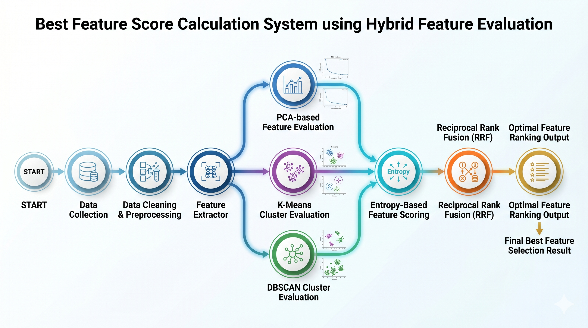
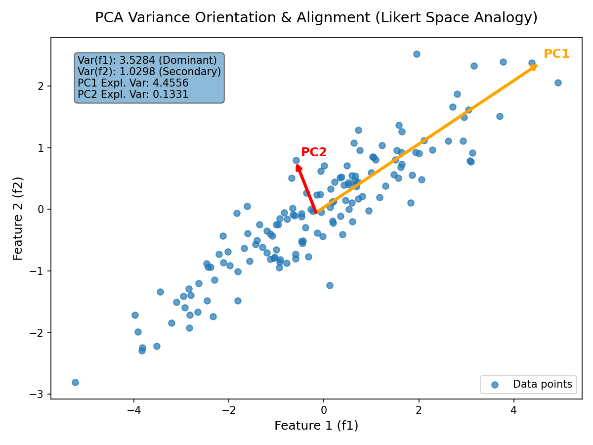
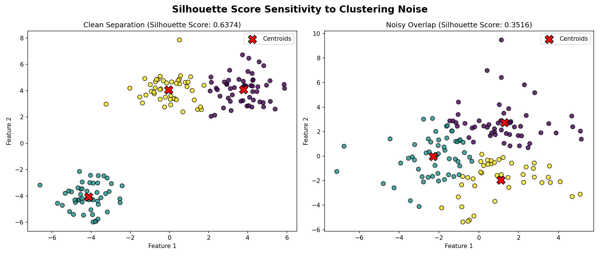

# Affecting Machine Flexibility (AMF) — Feature Selection Research



---

## Comprehensive Mathematical Intuition of the Unsupervised Feature Selection Algorithm

---

### 1. Mathematical Rigor & Theoretical Framework

This ecosystem targets complex manufacturing operations data (such as the *Affecting Machine Flexibility* domain) containing high-dimensional, highly discrete variables with varying informational value. Traditional single-criterion filtering techniques fail to maintain downstream model flexibility.

```
                           RAW DATA MATRIX [X]
                                    │
                     ┌──────────────┴──────────────┐
                     ▼                             ▼
            Continuous Scaler               Missing Value Truncation
             (MinMaxScaler)                  (Iterative `.dropna()`)
                     │                             │
                     └──────────────┬──────────────┘
                                    ▼
                       PREPROCESSED DATA MATRIX [X']
                                    │
       ┌────────────────────────────┼────────────────────────────┬────────────────────────────┐
       ▼                            ▼                            ▼                            ▼
[Extractor 1: PCA]          [Extractor 2: K-Means]       [Extractor 3: DBSCAN]        [Extractor 4: Entropy]
• LOFO Recon Error          • LOFO Silhouette Shift      • LOFO Safe Silhouette       • Shannon Entropy
• LOFO Direction Shift      • Silhouette Optimization    • Density Neighborhoods      • Value Diversity
• Beta Blending (S_PCA)     • (kmeans_score.csv)         • (dbscan_score.csv)         • (entropy_score.csv)
• (pca_score.csv)
       │                            │                            │                            │
       └────────────────────────────┼────────────────────────────┼────────────────────────────┘
                                    ▼
                       RECIPROCAL RANK FUSION (RRF)
                  RRF(f) = Σ [ w_s / (rrf_k + Rank_s(f)) ]
              Weights: PCA (0.5), KMeans (0.3), DBSCAN (0.1), Entropy (0.1)
              Dampening Constant: rrf_k = 30
                                    │
                                    ▼
                        OPTIMAL RE-RANKED FEATURES
                          (hybrid_rrf_score.csv)
```

---

## Strategy 1 — PCA-Based Feature Importance

---

### Why PCA? Motivation & Advantages

The AMF dataset is a **Likert-scale survey** (ratings 1–5) collected from 103 manufacturing companies across 9 machine flexibility attributes. The data is:

- **High-dimensional relative to sample size** — 9 features, 103 observations
- **Highly correlated** — features like *"Type of operations"* and *"Max operations available"* naturally co-vary
- **Unlabeled** — no target variable exists to run supervised feature selection

#### Why traditional methods fail here

| Method | Problem for AMF |
|---|---|
| Filter (variance) | Doesn't capture inter-feature relationships |
| Mutual Information | Needs a target label |
| Correlation drop | Removes both correlated features equally — loses information |
| Random Forest | Supervised only |

#### Why PCA works here

PCA finds the directions of **maximum variance** in the data — i.e., the linear combinations of features that explain the most information. By using a **Leave-One-Feature-Out (LOFO)** approach with PCA, we can answer:

> *"If I remove feature $m$, how much does the principal structure of the data collapse?"*

A feature that causes a large collapse when removed is **highly important**.



**Key advantages for this problem:**
1. **Unsupervised** — no labels needed
2. **Captures global covariance structure** — not just variance of individual columns
3. **Dual signal** — both *reconstruction fidelity* AND *principal direction shift* are measured
4. **Noise-robust** — PCA naturally filters sampling noise in Likert data

---

### 2. Data: Input to the Pipeline

**Source file:** `data/survey1_amf.csv`

**Raw shape:** `(108 rows × 11 columns)` — including header rows, average row, ranking row

**After preprocessing (dropna + drop_duplicates):** `103 companies × 9 AMF features`

#### The 9 AMF Features

| # | Feature Name |
|---|---|
| 1 | Types of machine |
| 2 | Maximum number of tools available |
| 3 | Maximum number of operation available |
| 4 | Tool magazine or tool turret capacity |
| 5 | Tool changing time |
| 6 | Type of operations to be done on machine |
| 7 | Variety of parts to be handled by the machine |
| 8 | Skills and versatility of workers |
| 9 | Setup or changeover time |

**Sample raw values (Likert 1–5):**

| Organization | Types | Max Tools | Max Ops | Tool Mag | Tool Time | Op Type | Variety | Skills | Setup |
|---|---|---|---|---|---|---|---|---|---|
| Relaible Bitumen | 4.0 | 5.0 | 4.0 | 5.0 | 4.0 | 5.0 | 4.0 | 5.0 | 4.0 |
| Ashok Leyland | 5.0 | 4.0 | 5.0 | 5.0 | 4.0 | 3.0 | 4.0 | 5.0 | 4.0 |
| Bajaj Auto | 5.0 | 4.0 | 5.0 | 4.0 | 4.0 | 5.0 | 5.0 | 5.0 | 4.0 |
| Sailatha (low) | 3.0 | 3.0 | 3.0 | 4.0 | 3.0 | 3.0 | 3.0 | 3.0 | 3.0 |
| LT Komatsu (high) | 5.0 | 5.0 | 5.0 | 5.0 | 5.0 | 5.0 | 5.0 | 5.0 | 5.0 |

---

### 3. Preprocessing Pipeline

```
survey1_amf.csv
      │
      ▼  read_csv → shape (108, 11)
      │
      ▼  dropna() + drop_duplicates(on='Name of organization')
      │
      ▼  shape (103, 11)  →  select AMF_ columns only
      │
      ▼  shape (103, 9)   →  MinMaxScaler.fit_transform()
      │                       x̃ = (x - min) / (max - min)   ∈ [0.0, 1.0]
      │
      ▼  np.square()  →  x' = x̃²                            ∈ [0.0, 1.0]
      │    (amplifies high ratings, suppresses low ratings)
      │
      ▼  torch.tensor(dtype=float32)
      │
      ▼  X  →  shape: (103, 9)   [n_samples=103, n_features=9]
```

**Matrix shape entering the PCA pipeline:**

$$X \in \mathbb{R}^{103 \times 9}$$

Each row = one company's survey response (normalized + squared).
Each column = one AMF feature.

---

### 4. PCA Feature Importance — LOFO Architecture

The core idea: **run PCA on the full data, then drop one feature at a time and measure how much the principal structure degrades.**

#### Step 1 — Baseline PCA on Full Matrix

```
X  [103 × 9]
      │
      ▼  PCA(n_components=1).fit_transform(X)
      │
      ├──► X_pca   [103 × 1]   (projection onto PC1)
      │
      ▼  pca.inverse_transform(X_pca)
      │
      ▼  X_reconstructed  [103 × 9]
      │
      ▼  E_full = mean((X - X_reconstructed)²)   →  scalar
      │
      ▼  pc1_full = pca.components_[0]            →  shape (9,)
```

$E_{\text{full}}$ is the baseline reconstruction error using only 1 principal component across all 9 features.

$\mathbf{pc1}_{\text{full}} \in \mathbb{R}^9$ is the first principal axis — the direction capturing the most variance in the full 9D space.

---

#### Step 2 — LOFO Loop (9 iterations, one per feature)

For each feature $m \in \{0, 1, \ldots, 8\}$:

```
X  [103 × 9]
      │
      ▼  drop column m  (mask = all columns except m)
      │
      ▼  X_drop  [103 × 8]
      │
      ├────────────────────────────────┬────────────────────────────────┐
      ▼                                ▼                                │
PCA(n_components=1)            PCA(n_components=1)                    │
.fit_transform(X_drop)         .fit(X_drop)                           │
      │                                │                               │
      ▼                                ▼                               │
X_drop_pca [103×1]           pc1_i = components_[0]  →  shape (8,)   │
      │                                                                │
      ▼                                                                │
inverse_transform → X_drop_reconstructed [103×8]                      │
      │                                                                │
      ▼                                                                │
E_i = mean((X_drop - X_drop_reconstructed)²)  →  scalar              │
      │                                                                │
      ▼                                                                │
recon_scores[m] = E_i - E_full                                        │
      │  (positive = feature was helping PCA compress the data)       │
      │                                                                │
      └───────────────────── cosine comparison ───────────────────────┘
                                      │
      a = pc1_full[:8]   [8,]         │  (truncate to match length)
      b = pc1_i          [8,]         │
                                      ▼
      cos_sim = dot(a, b) / (‖a‖₂ · ‖b‖₂)   →  scalar ∈ [-1, 1]
                                      │
                                      ▼
      direction_scores[m] = 1 - cos_sim
      │  (0 = removing feature did NOT rotate the principal axis)
      │  (2 = principal axis completely flipped — feature was critical)
```

**Outputs after the loop:**

- $\mathbf{recon} \in \mathbb{R}^9$ (saved as `pca_reconstruction_error.csv`)
- $\mathbf{direction} \in \mathbb{R}^9$ (saved as `pca_direction_score.csv`)

---

#### Step 3 — Combine into PCA Score

$$S_{\text{PCA}}[m] = \beta \cdot \text{recon}[m] + (1 - \beta) \cdot \text{direction}[m]$$

With $\beta = 0.5$ (equal weight to both signals):

$$S_{\text{PCA}}[m] = 0.5 \cdot \text{recon}[m] + 0.5 \cdot \text{direction}[m]$$

→ saved as `pca_score.csv`

---

### 5. PCA Pipeline Flow (with shapes)

```
X  [103 × 9]  (preprocessed tensor)
      │
      ├──────────────────────── BASELINE ─────────────────────────────┐
      │                                                                │
      │  PCA(1).fit_transform(X)                                       │
      │  X_pca [103×1] ──► inverse_transform ──► X_rec [103×9]        │
      │  E_full = mean((X - X_rec)²)  →  scalar                       │
      │  pc1_full = components_[0]    →  shape (9,)                   │
      │                                                                │
      └──────────────────── LOFO LOOP (×9) ───────────────────────────┘
               │  for m in [0..8]:
               │
               │  X_drop = X[:, mask_m]   [103 × 8]
               │     │
               │     ├──► PCA(1).fit_transform(X_drop)  [103×1]
               │     │    inverse_transform             [103×8]
               │     │    E_i = mean((X_drop - X_drop_rec)²)
               │     │    recon_scores[m] = E_i - E_full
               │     │
               │     └──► PCA(1).fit(X_drop)
               │          pc1_i = components_[0]   [8,]
               │          cos_sim = dot(pc1_full[:8], pc1_i) / (‖·‖·‖·‖)
               │          direction_scores[m] = 1 - cos_sim
               │
               ▼
      recon_scores   [9,]   ──► pca_reconstruction_error.csv
      direction_scores [9,] ──► pca_direction_score.csv
               │
               ▼
      pca_score = 0.5 * recon_scores + 0.5 * direction_scores  [9,]
                             ──► pca_score.csv
```

---

### 6. Actual Output Results

#### Output File 1 — `pca_reconstruction_error.csv`

> **Interpretation:** `recon_scores[m] = E_i - E_full` — how much the reconstruction error *increases* when feature $m$ is removed. Negative values mean the feature was not helping PCA (its removal slightly improved compression — noise feature). Positive means the feature was genuinely informative.

<!-- START_TABLE: pca_reconstruction_error -->
| Feature | Recon Score (E_i − E_full) |
|---|---|
| Types of machine | −0.000915 |
| Maximum number of tools available | −0.002778 |
| Maximum number of operation available | −0.004136 |
| Tool magazine or tool turret capacity | +0.000573 |
| Tool changing time | −0.001342 |
| Type of operations to be done on machine | −0.002611 |
| Variety of parts to be handled by the machine | +0.000119 |
| Skills and versatility of workers | −0.005914 |
| Setup or changeover time | −0.002196 |
<!-- END_TABLE: pca_reconstruction_error -->

> Most values are slightly negative, which is expected for correlated Likert data — the reconstruction error on 8 features is often marginally better than on 9 (reduced noise). The **direction score** is the primary signal.

---

#### Output File 2 — `pca_direction_score.csv`

> **Interpretation:** How much the first principal direction *rotates* when feature $m$ is removed. `1 - cos_sim`. Higher = removing this feature changes what PCA "thinks" is the most important direction → feature is critical to the global structure.

<!-- START_TABLE: pca_direction_score -->
| Feature | Direction Score (1 − cos_sim) | Rank |
|---|---|---|
| **Types of machine** | **0.4123** | 🥇 1st |
| **Maximum number of tools available** | **0.3972** | 🥈 2nd |
| Type of operations to be done on machine | 0.2063 | 🥉 3rd |
| Tool magazine or tool turret capacity | 0.1908 | 4th |
| Tool changing time | 0.1907 | 5th |
| Maximum number of operation available | 0.1769 | 6th |
| Skills and versatility of workers | 0.0767 | 7th |
| Variety of parts to be handled by the machine | 0.0591 | 8th |
| Setup or changeover time | 0.0554 | 9th |
<!-- END_TABLE: pca_direction_score -->

> **Types of machine** and **Max tools** cause the largest principal direction shift when removed — they are the most structurally critical features for the AMF space.

---

#### Output File 3 — `pca_score.csv`

> **Formula:** `pca_score = 0.5 × recon_score + 0.5 × direction_score`

<!-- START_TABLE: pca_score -->
| Feature | PCA Score | Rank |
|---|---|---|
| **Types of machine** | **0.2057** | 🥇 1st |
| **Maximum number of tools available** | **0.1972** | 🥈 2nd |
| Type of operations to be done on machine | 0.1018 | 🥉 3rd |
| Tool magazine or tool turret capacity | 0.0957 | 4th |
| Tool changing time | 0.0947 | 5th |
| Maximum number of operation available | 0.0864 | 6th |
| Skills and versatility of workers | 0.0354 | 7th |
| Variety of parts to be handled by the machine | 0.0296 | 8th |
| Setup or changeover time | 0.0266 | 9th |
<!-- END_TABLE: pca_score -->

---

### 7. Summary — What PCA Tells Us About AMF

```
STRUCTURAL LEADERS (high direction score):
  ┌─────────────────────────────────────────┐
  │  Types of machine          (score 0.41) │  ← removing this rotates PC1 most
  │  Max tools available       (score 0.40) │  ← second largest structural shift
  └─────────────────────────────────────────┘

MODERATE CONTRIBUTORS (mid direction score):
  ┌─────────────────────────────────────────┐
  │  Type of operations        (score 0.21) │
  │  Tool magazine capacity    (score 0.19) │
  │  Tool changing time        (score 0.19) │
  │  Max operations            (score 0.18) │
  └─────────────────────────────────────────┘

PERIPHERAL FEATURES (low direction score):
  ┌─────────────────────────────────────────┐
  │  Skills of workers         (score 0.08) │
  │  Variety of parts          (score 0.06) │
  │  Setup/changeover time     (score 0.06) │
  └─────────────────────────────────────────┘
```

**Bottom line from PCA:** In the AMF domain, the *machine hardware attributes* (types, tools, operations) dominate the principal variance structure. *Workforce and process attributes* (skills, setup time, variety of parts) are structurally secondary in terms of PCA variance but will be captured by clustering and entropy extractors.

---

## 2. Data Preprocessing

Let $X \in \mathbb{R}^{n \times m}$ represent the raw metadata array consisting of $m = 9$ analytical vectors over $n = 103$ observed units. To counter artificial tracking matrix perturbations introduced during sheet processing, complete row empty intersections are truncated dynamically:

$$X' = \{x_i \in X \mid \forall j, \, x_{i,j} \neq \text{NaN}\}$$

The functional space operates under boundary adjustments:

$$\tilde{x}_{i,j} = \frac{x_{i,j} - \min(X_{\cdot, j})}{\max(X_{\cdot, j}) - \min(X_{\cdot, j})}$$

---

## Strategy 2 — K-Means Silhouette Differential

---

### Why K-Means for Feature Selection?

K-Means clusters the data into $k$ compact groups. A good set of features produces **well-separated, cohesive clusters** measured by the **Silhouette Score**. The key insight:

> *If removing a feature causes the cluster quality to drop, that feature was helping the data separate into meaningful groups — it is important.*

**Advantages over raw statistical measures:**
- Captures **non-linear groupings** — companies with similar machine setups cluster together even if individual feature correlations are weak
- **Optimal k selection** — the code auto-selects best $k \in [2,10]$ by maximising silhouette on the full dataset
- Complements PCA — where PCA finds global variance directions, K-Means finds **local cluster structure**

**Silhouette Score** $s(i)$ for point $i$:

$$s(i) = \frac{b(i) - a(i)}{\max(a(i),\, b(i))} \in [-1, 1]$$

- $a(i)$ = mean intra-cluster distance (cohesion)
- $b(i)$ = mean distance to nearest other cluster (separation)
- Score = 1 → perfect clustering, Score = -1 → wrong cluster assignment



---

### K-Means Pipeline (with shapes)

#### Step 1 — Find Optimal k

```
X  [103 × 9]
      │
      ▼  for k in [2, 3, 4, ..., 10]:
      │      labels = KMeans(n_clusters=k, n_init=10).fit_predict(X_np)
      │      score  = silhouette_score(X_np, labels)   →  scalar
      │
      ▼  best_k = argmax(scores) + 2    →  integer
```

The best $k$ is the number of clusters that gives the highest silhouette on all 9 features.

#### Step 2 — Baseline Silhouette on Full Matrix

```
X  [103 × 9]
      │
      ▼  KMeans(n_clusters=best_k).fit_predict(X_np)
      │
      ▼  labels_full  [103,]   (cluster ID per company)
      │
      ▼  base_score = silhouette_score(X_np, labels_full)   →  scalar
```

#### Step 3 — LOFO Loop (9 iterations)

For each feature $m \in \{0, \ldots, 8\}$:

```
X  [103 × 9]
      │
      ▼  X_drop = X[:, mask_m]   →  [103 × 8]
      │
      ▼  KMeans(n_clusters=best_k).fit_predict(X_drop_np)
      │
      ▼  labels  [103,]
      │
      ▼  score = silhouette_score(X_drop_np, labels)   →  scalar
      │
      ▼  kmeans_scores[m] = base_score - score
             (positive = feature helped clustering;
              removing it hurt the silhouette)
```

$$\Delta S_{\text{KMeans}}(m) = S_{\text{KMeans}}(X) - S_{\text{KMeans}}(X_{-m})$$

---

### Complete K-Means Flow

```
X  [103 × 9]
      │
      ├──► find_best_k(X)  →  best_k  (scalar)
      │
      ├──► KMeans(best_k).fit_predict(X)  →  labels_full [103,]
      │    silhouette_score(X, labels_full) → base_score  (scalar)
      │
      └──► LOFO loop (×9):
               X_drop [103×8]
               KMeans(best_k).fit_predict(X_drop) → labels [103,]
               silhouette_score(X_drop, labels) → score_i
               kmeans_scores[m] = base_score - score_i
               │
               ▼
      kmeans_scores   [9,]   ──► kmeans_score.csv
```

---

### K-Means Actual Output Results

#### Output File 1 — `kmeans_score.csv`

> **Interpretation:** `base_score - silhouette(X_drop)`. Positive = feature helps cluster separation. Negative = removing the feature actually *improved* clustering (redundant/noisy feature).

<!-- START_TABLE: kmeans_score -->
| Feature | ΔSilhouette Score | Signal |
|---|---|---|
| **Tool magazine or tool turret capacity** | **+0.009360** | 🥇 Most helpful |
| **Skills and versatility of workers** | **+0.006087** | 🥈 2nd helpful |
| Type of operations to be done on machine | −0.012641 | slightly hurts |
| Types of machine | −0.014932 | slightly hurts |
| Tool changing time | −0.015816 | slightly hurts |
| Maximum number of tools available | −0.019724 | hurts cluster quality |
| Variety of parts to be handled by the machine | −0.028571 | hurts cluster quality |
| Setup or changeover time | −0.033436 | hurts cluster quality |
| **Maximum number of operation available** | **−0.034347** | 🔻 Most disruptive |
<!-- END_TABLE: kmeans_score -->

> K-Means gives a **very different signal** from PCA. Features that dominate variance (Types of machine, Max tools) are *not* the ones helping cluster separation — they are shared across all clusters. *Tool magazine capacity* and *Skills* create the meaningful company groupings.

---

## Strategy 3 — DBSCAN Density Neighbourhood Traversal

---

### Why DBSCAN for Feature Selection?

DBSCAN (Density-Based Spatial Clustering of Applications with Noise) finds clusters of **arbitrary shape** in density-connected regions. Unlike K-Means, it:

- **Does not require specifying $k$** — clusters emerge from density
- **Identifies noise points** (label = -1) — isolates outlier companies
- Works well with **non-convex structures** in the AMF survey space

The feature importance logic is identical to K-Means — LOFO silhouette differential — but the underlying cluster structure is fundamentally different.

**Parameters used:**
- `eps = 0.9` — ε-neighbourhood radius
- `min_samples = 3` — minimum points to form a core point

**Safe Silhouette:** If fewer than 2 non-noise clusters form (all points are noise), the score is set to 0 to avoid errors.

$$\Delta S_{\text{DBSCAN}}(m) = S_{\text{DBSCAN}}(X) - S_{\text{DBSCAN}}(X_{-m})$$

---

### DBSCAN Pipeline (with shapes)

#### Step 1 — Baseline Clustering on Full Matrix

```
X  [103 × 9]   (preprocessed tensor → numpy)
      │
      ▼  DBSCAN(eps=0.9, min_samples=3).fit_predict(X_np)
      │
      ▼  labels_full  [103,]   (cluster IDs, -1 = noise)
      │
      ▼  safe_silhouette(X_np, labels_full):
      │      unique_clusters = set(labels) - {-1}
      │      if len(unique_clusters) < 2: return 0
      │      else: return silhouette_score(X_np, labels_full)
      │
      ▼  base_score   →  scalar
```

#### Step 2 — LOFO Loop (9 iterations)

```
X  [103 × 9]
      │
      ▼  for m in [0..8]:
      │      X_drop = X[:, mask_m]   →  [103 × 8]
      │
      │      DBSCAN(eps=0.9, min_samples=3).fit_predict(X_drop_np)
      │      →  labels [103,]
      │
      │      score = safe_silhouette(X_drop_np, labels)
      │
      │      dbscan_scores[m] = base_score - score
      │          (positive = feature helped density structure)
      │          (negative = removing it improved or changed nothing)
```

---

### Complete DBSCAN Flow

```
X  [103 × 9]
      │
      ├──► DBSCAN(eps=0.9, min_samples=3).fit_predict(X)
      │    safe_silhouette(X, labels_full) → base_score  (scalar)
      │
      └──► LOFO loop (×9):
               X_drop [103×8]
               DBSCAN(eps=0.9, min_samples=3).fit_predict(X_drop)
               → labels [103,]
               safe_silhouette(X_drop, labels) → score_i
               dbscan_scores[m] = base_score - score_i
               │
               ▼
      dbscan_scores  [9,]   ──► dbscan_score.csv
```

---

### DBSCAN Actual Output Results

#### Output File 1 — `dbscan_score.csv`

> **Interpretation:** `base_score - safe_silhouette(X_drop)`. Positive = feature is essential for the density structure. The same value (0.0356) appears for 4 features — DBSCAN clustered them identically when those features were dropped (robust density was maintained).

<!-- START_TABLE: dbscan_score -->
| Feature | DBSCAN ΔSilhouette | Signal |
|---|---|---|
| **Types of machine** | **+0.035563** | 🥇 Critical (tied) |
| **Maximum number of tools available** | **+0.035563** | 🥇 Critical (tied) |
| **Tool magazine or tool turret capacity** | **+0.035563** | 🥇 Critical (tied) |
| **Type of operations to be done on machine** | **+0.035563** | 🥇 Critical (tied) |
| Variety of parts to be handled by the machine | −0.003423 | minor negative |
| Tool changing time | −0.015010 | moderate negative |
| Setup or changeover time | −0.043415 | moderate negative |
| Maximum number of operation available | −0.056267 | moderate negative |
| **Skills and versatility of workers** | **−0.061819** | 🔻 Most disruptive |
<!-- END_TABLE: dbscan_score -->

> **Notable:** DBSCAN gives 4 features an identical positive score — removing any one of these 4 equally degrades the density structure. Skills and Max operations score negatively (removing them slightly *clarifies* the density clusters — they introduce noise in the ε-neighbourhood space).

---

## Strategy 4 — Shannon Entropy Feature Importance

---

### Why Shannon Entropy?

Features with near-constant values across respondents (low diversity) carry very little information and act as structural noise in unsupervised algorithms. Shannon Entropy of each feature's value distribution (calculated on normalized and squared ratings) is computed to isolate and reward feature value diversity:

$$H(X_m) = -\sum_{k} P(x_{k,m}) \log_2 P(x_{k,m})$$

- **High entropy** $\rightarrow$ feature has diverse and well-distributed responses $\rightarrow$ **highly informative, keep**
- **Low entropy** $\rightarrow$ responses are concentrated around a single value $\rightarrow$ **uninformative, penalize**

Entropy is now treated as an **independent extractor** that contributes directly to the Reciprocal Rank Fusion stage, allowing the RRF to balance global cluster geometry with local informational density.

---

### Entropy Actual Output Results

#### Output File — `entropy_score.csv`

> **Interpretation:** Shannon entropy of each feature's value distribution. Higher = more diverse.

<!-- START_TABLE: entropy_score -->
| Feature | Entropy H(X_m) |
|---|---|
| Maximum number of operation available | 1.0359 |
| Tool magazine or tool turret capacity | 1.0313 |
| Type of operations to be done on machine | 1.0243 |
| Skills and versatility of workers | 1.0011 |
| Types of machine | 0.9687 |
| Maximum number of tools available | 0.9657 |
| Tool changing time | 0.9402 |
| Setup or changeover time | 0.9110 |
| Variety of parts to be handled by the machine | 0.8979 |
<!-- END_TABLE: entropy_score -->

---

## Strategy Comparison — What Each Method Sees

<!-- START_TABLE: strategy_comparison -->
| Feature | PCA Rank | KMeans Rank | DBSCAN Rank | Entropy Rank |
|---|---|---|---|---|
| Types of machine | 1 | 4 | 1 | 5 |
| Maximum number of tools available | 2 | 6 | 2 | 6 |
| Type of operations to be done on machine | 3 | 3 | 4 | 3 |
| Tool magazine or tool turret capacity | 4 | 1 | 3 | 2 |
| Tool changing time | 5 | 5 | 6 | 7 |
| Maximum number of operation available | 6 | 9 | 8 | 1 |
| Skills and versatility of workers | 7 | 2 | 9 | 4 |
| Variety of parts to be handled by the machine | 8 | 7 | 5 | 9 |
| Setup or changeover time | 9 | 8 | 7 | 8 |
<!-- END_TABLE: strategy_comparison -->

> **Key divergence:** PCA sees *Types of machine* and *Max tools* as structurally dominant (they anchor the variance axis). K-Means and DBSCAN see *Tool magazine capacity* and *Type of operations* as cluster-defining. Entropy highlights *Max operations available* as having the highest response diversity. This is exactly why multi-strategy RRF is needed — no single method captures the full picture.

---

## Strategy 5 — Reciprocal Rank Fusion (Hybrid)

---

### Why RRF? Motivation

Each of the four strategies gives a **different and partially conflicting ranking**. Naively averaging scores is unreliable because the scales differ (PCA scores ≈ 0.2, KMeans scores ≈ 0.01, DBSCAN scores ≈ 0.03, Entropy scores ≈ 1.0). RRF solves this by fusing **ordinal ranks** (1st, 2nd, ..., 9th) rather than raw scores, making it robust to scale differences and outliers.

$$\text{Score}_{\text{RRF}}(f) = \sum_{s \in \{PCA, KMeans, DBSCAN, Entropy\}} \frac{w_s}{rrf\_k + r_s(f)}$$

**Parameters:**
- $w_{\text{PCA}} = 0.5$ — PCA carries the highest weight (anchors global covariance structure)
- $w_{\text{KMeans}} = 0.3$ — KMeans carries weight for local centroid clustering
- $w_{\text{DBSCAN}} = 0.1$ — DBSCAN represents density-based clustering structures
- $w_{\text{Entropy}} = 0.1$ — Entropy ensures informational diversity is represented
- $rrf\_k = 30$ — dampening constant (prevents rank-1 from dominating too heavily)

---

### Hybrid RRF Pipeline (with shapes)

```
pca_score.csv      →  pca_df       [9 rows × 2 cols]
kmeans_score.csv   →  kmean_df     [9 rows × 2 cols]
dbscan_score.csv   →  dbscan_df    [9 rows × 2 cols]
entropy_score.csv  →  entrpy_df    [9 rows × 2 cols]
      │
      ▼  sort each by 'scores' descending
      │  assign rank = [1, 2, 3, ..., 9]
      │
      ▼  for each feature f:
      pca_rrf[f]    = 0.5 / (30 + rank_pca[f])
      kmean_rrf[f]  = 0.3 / (30 + rank_kmean[f])
      dbscan_rrf[f] = 0.1 / (30 + rank_dbscan[f])
      entrpy_rrf[f] = 0.1 / (30 + rank_entrpy[f])
      │
      ▼  final_score[f] = pca_rrf[f] + kmean_rrf[f] + dbscan_rrf[f] + entrpy_rrf[f]
      │
      ▼  sort by final_score descending
      │
      ▼  hybrid_rrf_score.csv   [9 rows × 2 cols]
```

---

### Hybrid RRF Actual Output — `hybrid_rrf_score.csv`

> This is the **final output** of the entire pipeline — the definitive feature ranking for AMF.

<!-- START_TABLE: hybrid_rrf_score -->
| Final Rank | Feature | Hybrid RRF Score |
|---|---|---|
| 🥇 1 | **Types of machine** | **0.031036** |
| 🥈 2 | **Tool magazine or tool turret capacity** | **0.030539** |
| 🥉 3 | **Type of operations to be done on machine** | **0.030214** |
| 4 | Maximum number of tools available | 0.029861 |
| 5 | Skills and versatility of workers | 0.028394 |
| 6 | Tool changing time | 0.028338 |
| 7 | Maximum number of operation available | 0.027439 |
| 8 | Variety of parts to be handled by the machine | 0.026687 |
| 9 | Setup or changeover time | 0.026050 |
<!-- END_TABLE: hybrid_rrf_score -->

---

### Why This Final Ranking Makes Sense

```
TIER 1 — Machine Hardware Core  (RRF > 0.030)
  ┌──────────────────────────────────────────────────────────────┐
  │  🥇 Types of machine                                         │
  │  🥈 Tool magazine capacity                                   │
  │  🥉 Type of operations to be done on machine                 │
  └──────────────────────────────────────────────────────────────┘
  These define WHAT kind of manufacturing flexibility a company has.
  They are highly weighted because PCA and KMeans agree on their structural strength.

TIER 2 — Capacity & Resource Capabilities  (RRF 0.028–0.030)
  ┌──────────────────────────────────────────────────────────────┐
  │  Maximum number of tools available                           │
  │  Skills and versatility of workers                           │
  │  Tool changing time                                          │
  └──────────────────────────────────────────────────────────────┘
  These define the bounds of capability and resource speed.

TIER 3 — Process Constraints & Logistics  (RRF < 0.028)
  ┌──────────────────────────────────────────────────────────────┐
  │  Maximum number of operation available                       │
  │  Variety of parts to be handled by the machine               │
  │  Setup or changeover time                                    │
  └──────────────────────────────────────────────────────────────┘
  These are process metrics that vary less across companies in this sample.
```

---

## Full Pipeline Summary

```
survey1_amf.csv  [103 × 9]
      │
      ▼  Preprocessing: MinMaxScaler → square → torch.Tensor
      │
      ├──────────────────── Strategy 1: PCA ─────────────────────────
      │  LOFO: recon_err + cosine direction shift per feature
      │  β=0.5: pca_score = 0.5·recon + 0.5·direction
      │  Output: pca_score.csv              (weight=0.5 in RRF)
      │
      ├──────────────────── Strategy 2: K-Means ──────────────────────
      │  Auto-select best k via silhouette
      │  LOFO: Δsilhouette = base_score - silhouette(X_drop)
      │  Output: kmeans_score.csv           (weight=0.3 in RRF)
      │
      ├──────────────────── Strategy 3: DBSCAN ───────────────────────
      │  eps=0.9, min_samples=3; safe silhouette (handles noise)
      │  LOFO: Δsilhouette = base_score - safe_silhouette(X_drop)
      │  Output: dbscan_score.csv           (weight=0.1 in RRF)
      │
      ├──────────────────── Strategy 4: Shannon Entropy ──────────────
      │  Shannon Entropy of normalized column values
      │  Output: entropy_score.csv          (weight=0.1 in RRF)
      │
      └──────────────────── Hybrid RRF ────────────────────────────────
         Sort each strategy output → assign ranks 1..9
         RRF_score(f) = 0.5/(30+rank_pca) + 0.3/(30+rank_k) + 0.1/(30+rank_d) + 0.1/(30+rank_ent)
         Sort by RRF_score descending
         Output: hybrid_rrf_score.csv  ← FINAL ANSWER
```

---

## Final Re-Ranked Features (RRF Output)

<!-- START_TABLE: final_rrf_output -->
| Rank | Feature | Hybrid Score |
|---|---|---|
| 1 | Types of machine | 0.031036 |
| 2 | Tool magazine or tool turret capacity | 0.030539 |
| 3 | Type of operations to be done on machine | 0.030214 |
| 4 | Maximum number of tools available | 0.029861 |
| 5 | Skills and versatility of workers | 0.028394 |
| 6 | Tool changing time | 0.028338 |
| 7 | Maximum number of operation available | 0.027439 |
| 8 | Variety of parts to be handled by the machine | 0.026687 |
| 9 | Setup or changeover time | 0.026050 |
<!-- END_TABLE: final_rrf_output -->

> This is how we perform **feature re-ranking** with the help of RRF.

---
